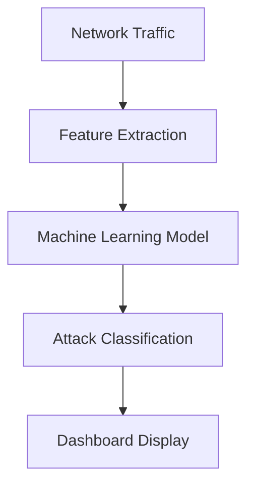

# AI-Based Network Intrusion Detection System (NIDS)

> A machine-learning system that analyzes network traffic and automatically detects cyber attacks.

---

## 1) What This Project Actually Is

Your project builds an **AI-based Network Intrusion Detection System (NIDS)**.

### In simple terms

It watches network traffic and identifies suspicious activity using machine learning, instead of relying only on manual monitoring.

---

## 2) What Skills You Gain From This Project

This project develops skills across four major domains:

| Domain | What You Learn | Examples |
|---|---|---|
| 🔐 Cybersecurity | How attacks appear in traffic and how detection works | DDoS, botnet traffic, port scanning, web attacks |
| 🤖 Machine Learning | Build models that classify traffic as normal or malicious | Random Forest, Decision Tree, SVM (optional) |
| 📊 Data Analysis | Work with high-dimensional real datasets (80+ features) | Cleaning, scaling, splitting, evaluation |
| 🖥 Software Development | Build an end-to-end ML system pipeline | Dataset → preprocessing → model → evaluation → dashboard |

### Example network features

- `Flow Duration`
- `Total Packets`
- `Packet Size`
- `Flow Bytes/s`

---

## 3) What the Final System Does



### Example output

```text
Traffic detected: DDoS attack
Confidence: 97%
```

---

## 4) Real-World Applications

### 🏢 Companies

Enterprise networks use IDS tools such as:

- Snort
- Suricata
- Zeek

Your project is similar in purpose, but uses **AI-driven detection** instead of only rule-based logic.

### ☁️ Cloud Security

Cloud providers use ML-based detection in services like:

- AWS GuardDuty
- Microsoft Defender
- Google Cloud Security

### 🏦 Financial Systems

Banks use traffic monitoring to detect:

- Bot traffic
- Automated attacks
- Scanning attempts

### 🧪 Cybersecurity Research

This aligns with academic intrusion detection research using datasets such as:

- CICIDS2017
- UNSW-NB15
- KDD99

---

## 5) How You Would Apply It in Practice

1. **Capture live network traffic**
   - Tools: Wireshark, tcpdump, Zeek
2. **Extract packet/flow features**
   - Examples: packet size, protocol, flow duration, packet count
3. **Send features to the trained model**
   - Prediction: `Normal` or `Attack`
4. **Trigger alerts for suspicious behavior**

### Example alert

```text
⚠ Possible DDoS attack detected
Source IP: 192.168.1.15
```

---

## 6) What You Can Put on Your CV

### Suggested CV entry

**AI-Based Network Intrusion Detection System**

- Developed a machine-learning system to detect malicious network traffic.
- Trained and evaluated models using the CICIDS2017 cybersecurity dataset.
- Achieved high classification performance with Random Forest.
- Built a dashboard for traffic analysis and visualization.

### Skills demonstrated

- Cybersecurity
- Machine Learning
- Python
- Data Analysis

---

## 7) Why This Is a Strong Final-Year Project

It combines multiple disciplines in one practical system:

- Networking
- Cybersecurity
- Artificial Intelligence
- Data Science
- Software Engineering

Many final projects focus only on CRUD/web development; this one is closer to **applied research + real security engineering**.

---

## 8) How to Explain It to Your Teacher

> This project develops a machine-learning-based intrusion detection system that analyzes network traffic data and classifies traffic as benign or malicious using cybersecurity datasets.

---

## 9) Possible Future Improvements

- [ ] Add real-time monitoring instead of dataset-only analysis
- [ ] Explore deep learning models (CNN, LSTM, Autoencoders)
- [ ] Integrate threat intelligence feeds (known malicious IPs)
- [ ] Deploy and test on a real network environment

---

## 10) The Most Important Thing

This project proves you can:

**Take a cybersecurity dataset → train an AI model → build a working detection system.**

That is highly valuable, real-world experience.